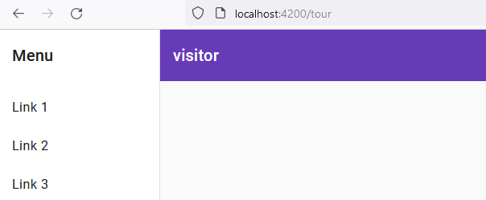
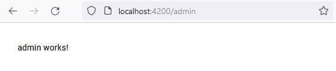
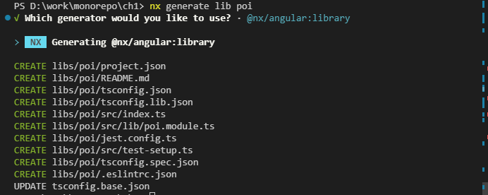
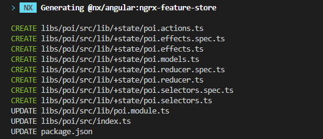

# Monos

<a alt="Nx logo" href="https://nx.dev" target="_blank" rel="noreferrer"></a>

✨ **This workspace has been generated by [Nx, a Smart, fast and extensible build system.](https://nx.dev)** ✨

## Start the app

To start the development server run `nx serve tour`. Open your browser and navigate to http://localhost:4200/. Happy coding!

## Generate code

If you happen to use Nx plugins, you can leverage code generators that might come with it.

Run `nx list` to get a list of available plugins and whether they have generators. Then run `nx list <plugin-name>` to see what generators are available.

Learn more about [Nx generators on the docs](https://nx.dev/plugin-features/use-code-generators).

## Running tasks

To execute tasks with Nx use the following syntax:

```
nx <target> <project> <...options>
```

You can also run multiple targets:

```
nx run-many -t <target1> <target2>
```

..or add `-p` to filter specific projects

```
nx run-many -t <target1> <target2> -p <proj1> <proj2>
```

Targets can be defined in the `package.json` or `projects.json`. Learn more [in the docs](https://nx.dev/core-features/run-tasks).

## Want better Editor Integration?

Have a look at the [Nx Console extensions](https://nx.dev/nx-console). It provides autocomplete support, a UI for exploring and running tasks & generators, and more! Available for VSCode, IntelliJ and comes with a LSP for Vim users.

## Ready to deploy?

Just run `nx build demoapp` to build the application. The build artifacts will be stored in the `dist/` directory, ready to be deployed.

## Set up CI!

Nx comes with local caching already built-in (check your `nx.json`). On CI you might want to go a step further.

- [Set up remote caching](https://nx.dev/core-features/share-your-cache)
- [Set up task distribution across multiple machines](https://nx.dev/core-features/distribute-task-execution)
- [Learn more how to setup CI](https://nx.dev/recipes/ci)

## Connect with us!

- [Join the community](https://nx.dev/community)
- [Subscribe to the Nx Youtube Channel](https://www.youtube.com/@nxdevtools)
- [Follow us on Twitter](https://twitter.com/nxdevtools)

---

npx @angular/cli@next new standalone-universal --standalone

---

<details>

<summary>ep.1</summary>

## Nx Monorepo Tools and NgRx

```js
mkdir monos
git init
mkdir ch1
cd ch1
npm install --location=global nx
npx create-nx-workspace monos --appName=tour --preset=angular --style=css --linter=eslint --nx-cloud=false --routing --directory ./
git al
git cm "init nx, ngrx prj"
git remote add origin git@github.com:viktishchenko/monorepo.git
git push -u origin master

// add scripts
  "scripts": {
    "ng": "nx",
    "postinstall": "node ./decorate-angular-cli.js && ngcc --properties es2015 browser module main",
    "nx": "nx",
    "start": "ng serve",
    "build": "ng build",
    "test": "ng test",
    "lint": "nx workspace-lint && ng lint",
    "e2e": "ng e2e",
    "affected:apps": "nx affected:apps",
    "affected:libs": "nx affected:libs",
    "affected:build": "nx affected:build",
    "affected:e2e": "nx affected:e2e",
    "affected:test": "nx affected:test",
    "affected:lint": "nx affected:lint",
    "affected:dep-graph": "nx affected:dep-graph",
    "affected": "nx affected",
    "format": "nx format:write",
    "format:write": "nx format:write",
    "format:check": "nx format:check",
    "update": "nx migrate latest",
    "workspace-generator": "nx workspace-generator",
    "dep-graph": "nx dep-graph",
    "help": "nx help"
  },

  // run
  npx nx run tour:serve
  // or Nx Console menu → GENERATE & RUN TARGET pane → serve → tour
```


</details>

<details>

<summary>ep.2</summary>

## Bulding the visitors portal

- init visitor app

```js
// add library
npx nx generate @nx/angular:library --name=visitor --no-interactive
// or
nx console → g → @nx/angular → library → name: visitor
```

- add component & Andualr Material

```js
// add material
npm install --save @angular/material

npx nx g @angular/material:ng-add --project=tour --theme=deeppurple-amber --typography=true --animations=true

 // add component w/o folder
npx nx generate @angular/material:navigation --name=visitor --project=visitor --flat=true --path=libs/visitor/src/lib --no-interactive

```

- add router

```js
// `app.module.ts`
import { BrowserAnimationsModule } from '@angular/platform-browser/animations';
import { RouterModule } from '@angular/router';

@NgModule({
  imports: [
    RouterModule.forRoot([
      {
        path: 'tour',
        loadChildren: () => import('@monos/visitor').then((m) => m.VisitorModule),
      },
      { path: '', pathMatch: 'full', redirectTo: 'tour' },
    ]),
  ],
})
export class AppModule {}
```

```js
// `visitor.module.ts`
import { RouterModule } from '@angular/router';

@NgModule({
  imports: [RouterModule.forChild([{ path: '', component: VisitorComponent }])],
})
export class VisitorModule {}

// run tour
```



</details>

<details>

<summary>ep.3</summary>

## Building the administrator portal

- init admin app (library & component) w route

```js
// add library
npx nx generate @nx/angular:library --name=admin --no-interactive --dry-run
// or
nx console → g → @nx/angular → library → name: admin
```

```js
 // add component w/o folder
npx nx generate @schematics/angular:component --name=admin --project=admin --no-interactive --dry-run
// or
nx console → g → @schematics/angular:component → name: admin → project: admin
```

```js
// `app.module.ts`
  {
    path: 'admin',
    loadChildren: () => import('@monos/admin').then((m) => m.AdminModule),
  },

// `a admin.module.ts`
import { RouterModule } from '@angular/router';

  RouterModule.forChild([
  { path: '', component: AdminComponent }
  ])
```



</details>

<details>

<summary>ep.4</summary>

## Managing application state with NgRx

```js
// add ngrx
npx nx generate @nx/angular:ngrx-root-store --project=tour --no-interactive --dry-run
// or
nx console → g → @nx/angular:ngrx-root-store → project: tour
```

- create library in Nx monorepo that will fetch & store data feature state

```js
nx generate lib poi --dry-run // @nx/angular:library
```



- add boilerplate code

```js
npx nx generate @nx/angular:ngrx-feature-store --name=poi --parent=libs/poi/src/lib/poi.module.ts --barrels=true --no-interactive
// or
nx console → g → @nx/angular:ngrx-feature-store → name:poi → parent:libs/poi/src/lib/poi.module.ts → barrels:re-export actions, state and selectors → directory:+state
```

// as prev command res

/_
• poi.actions.ts: Defines NgRx actions for the feature state
• poi.effects.ts: Defines NgRx effects for the feature state
• poi.models.ts: Defines an entity interface for POI data
• poi.reducer.ts: Defines NgRx reducers for the feature state
• poi.selectors.ts: Defines NgRx selectors for the feature state
_/



```js
// add service
nx generate service poi --project=poi --dry-run

// get data
import { HttpClient } from '@angular/common/http';
import { Injectable } from '@angular/core';
import { PoiEntity } from './+state/poi.models';
import { Observable } from 'rxjs';

@Injectable({
  providedIn: 'root',
})
export class PoiService {
  constructor(private http: HttpClient) {}

  getAll(): Observable<PoiEntity[]> {
    return this.http.get<PoiEntity[]>('assets/poi.json');
  }
}

// test data → poi.json
// + models/actions/effects
```

</details>
